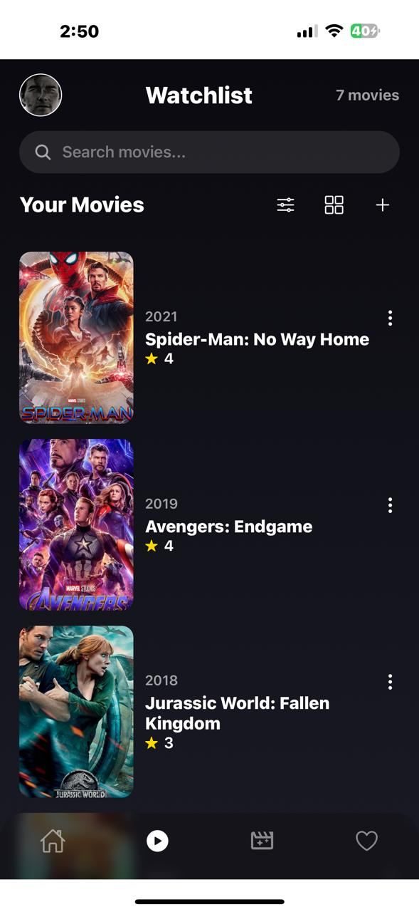
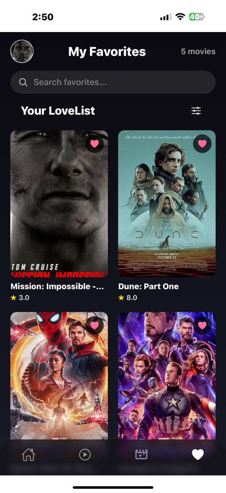
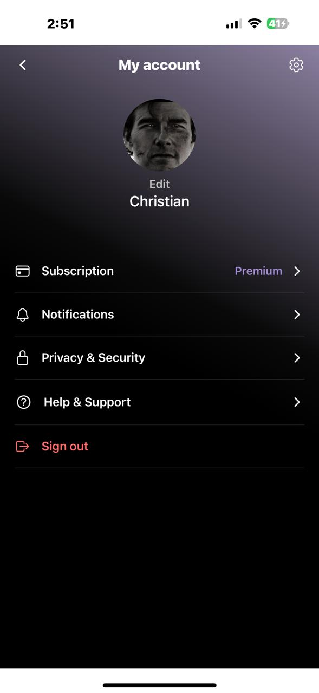

# MovieMood - Christian Al Alam

A comprehensive React Native mobile application for tracking your movie watching journey. Keep track of movies you want to watch, mark your favorites, and never forget what you've seen.

## Screenshots

<!-- 


 -->

<div style="display: flex; gap: 10px;">
  
  
  
  
</div>

## Features

### Core Features

- **User Authentication** - Secure login and registration system
- **Movie Management** - Add, edit, and delete movies from your collection
- **Watchlist** - Organize your movies with a beautiful grid or list view
- **Favorites** - Mark and track your favorite movies
- **Continue Watching** - Pick up where you left off with progress tracking
- **Search & Filter** - Find movies quickly with powerful search and filtering
- **Movie Details** - View comprehensive information about each movie

### Advanced Features

- **Progress Tracking** - Track how much of each movie you've watched
- **Add Movie via Search** – Search for a movie by name and automatically load details such as title, poster, genre, year, duration, and rating using the OMDB API.
- **Rating System** - Rate movies on a 5-point scale
- **Genre Classification** - Organize by Action, Comedy, Drama, Horror, Sci-Fi, and more
- **Movie Options Menu** - Quick access to edit, favorite, complete, or delete
- **Smart Filtering** - Filter by genre, year, rating, and sort options
- **Profile Management** - Customize your profile with avatar and name
- **Settings** - App info and account management

### Security & Privacy

- Local data storage with AsyncStorage
- Secure password handling
- Account deletion with double confirmation
- Privacy policy and terms of service

## Getting Started

### Prerequisites

- Node.js (v14 or higher)
- npm or yarn
- Expo CLI (`npm install -g expo-cli`)
- VS Code
- Expo Go app on your physical device

### Installation

#### 1. Clone the repository

```bash
git clone https://github.com/ChristianAlAlam/MovieMood-Mobile-Development-Course-Project-.git
cd MovieMood
```

#### 2. Install dependencies

```bash
npm install
# or
yarn insatll
```

#### 3. Start the development server

```bash
npx expo start
# or
npm start
```

#### 4. Run on your device

- Scan the QR code with Expo Go (Android) or Camera apps (iOs)
- Or press `a` for Android emulator
- Or press `i` for iOS simulator

## Dependencies

### Core Dependencies

```json
{
  "@expo/vector-icons": "^15.0.3",
  "@react-native-async-storage/async-storage": "2.2.0",
  "@react-native-community/slider": "^5.1.1",
  "@react-navigation/bottom-tabs": "^7.8.1",
  "@react-navigation/elements": "^2.6.3",
  "@react-navigation/native": "^7.1.19",
  "@react-navigation/native-stack": "^7.6.2",
  "@react-navigation/stack": "^7.6.2",
  "expo": "^54.0.23",
  "expo-blur": "~15.0.7",
  "expo-constants": "~18.0.10",
  "expo-font": "~14.0.9",
  "expo-haptics": "~15.0.7",
  "expo-image": "~3.0.10",
  "expo-image-picker": "~17.0.8",
  "expo-linear-gradient": "~15.0.7",
  "expo-linking": "~8.0.8",
  "expo-router": "^6.0.14",
  "expo-secure-store": "~15.0.7",
  "expo-splash-screen": "~31.0.10",
  "expo-status-bar": "~3.0.8",
  "expo-symbols": "~1.0.7",
  "expo-system-ui": "~6.0.8",
  "expo-web-browser": "~15.0.9",
  "formik": "^2.4.6",
  "react": "19.1.0",
  "react-dom": "19.1.0",
  "react-native": "0.81.5",
  "react-native-animatable": "^1.4.0",
  "react-native-gesture-handler": "~2.28.0",
  "react-native-reanimated": "~4.1.1",
  "react-native-safe-area-context": "~5.6.0",
  "react-native-screens": "~4.16.0",
  "react-native-web": "~0.21.0",
  "react-native-worklets": "0.5.1",
  "yup": "^1.7.1"
}
```

## Project Structure

```plaintext
MovieMood/
├── app/
│	├── index.tsx                      # Entry point
│	├── components/                    # Reusable Components
│	│   ├── backButton.js
│	│   ├── customButton.js
│	│   ├── customInput.js
│	│   ├── header.js
│	│   ├── movieCard.js
│	│   └── movieOptionMenu.js
│	├── modal/
│	│   ├── addMovieModal.js
│	│   ├── editMovieModal.js
│	│   └── filterModal.js
│	├── screens/                       ### Screen components
│	│   ├── continueWatchingScreen.js
│	│   ├── favoriteScreen.js
│	│   ├── homeScreen.js
│	│   ├── homeTabs.js                # Tabs Navigation
│	│   ├── landingScreen.js
│	│   ├── loginScreen.js
│	│   ├── movieDetailsScreen.js      # Details Screen
│	│   ├── movieScreen.js             # WatchlistScreen
│	│   ├── profileScreen.js
│	│   ├── registerScreen.js
│	│   └── settingsScreen.js
│	├── services/                      ### Business Logic & API Calls
│	│   ├── authService.js             # Authentication Control
│	│   ├── filterService.js           # Filter Control
│	│   └── movieService.js            # Movie Control
│   └── styles/                        ### StyleSheet Files
│	    ├── base/
│	    │   └── fonts.js               # Reusable Fonts StyleSheet
│	    ├── continueWatchingStyles.js
│	    ├── favoriteStyles.js
│	    ├── homeStyles.js
│	    ├── landingStyles.js
│	    ├── loginStyles.js
│	    ├── movieDetailsStyles.js
│	    ├── movieStyles.js             # Watchlist StyleSheet
│	    ├── profileStyles.js
│	    ├── registerStyles.js
│	    └── settingsStyles.js
└──	assets/                            # Images, fonts, etc.
```

## Design System

### Color Palette

- **Primary Background**: <span style="background-color:#0A0A0F; padding:2px 10px; border-radius:4px; color:white;">#0A0A0F</span>, <span style="background-color:#1A1A24; padding:2px 10px; border-radius:4px; color:white;">#1A1A24</span>
- **Accent Gold**: <span style="background-color:#D4AF37; padding:2px 10px; border-radius:4px; color:white;">#D4AF37</span>
- **Accent Purple**: <span style="background-color:#8B5CF6; padding:2px 10px; border-radius:4px; color:white;">#8B5CF6</span>
- **Success Green**: <span style="background-color:#4CAF50; padding:2px 10px; border-radius:4px; color:white;">#4CAF50</span>
- **Error Red**: <span style="background-color:#FF4757; padding:2px 10px; border-radius:4px; color:white;">#FF4757</span>
- **Favorite Pink**: <span style="background-color:#FF6B9D; padding:2px 10px; border-radius:4px; color:white;">#FF6B9D</span>
- **Star Gold**: <span style="background-color:#FFD700; padding:2px 10px; border-radius:4px; color:white;">#FFD700</span>

### Typography

- **Headings**: System Font or `Roboto`, 600-700 weight
- **Body**: System Font or `Roboto`, 400-500 weight
- **Captions**: System Font or `Roboto`, 300 weight

## Configuration

### Storage Keys

The app uses AsyncStorage with the following keys:

| Key                       | Storage                 | Description                                                                                                                                                                                        |
| ------------------------- | ----------------------- | -------------------------------------------------------------------------------------------------------------------------------------------------------------------------------------------------- |
| `@moviemood_users`        | AsyncStorage            | Array of all registered users. Each user object contains `id`, `name`, `email`, `password`, `avatar`, and `createdAt`.                                                                             |
| `@moviemood_current_user` | AsyncStorage            | Email of the currently logged-in user.                                                                                                                                                             |
| `auth_token`              | SecureStore             | Auth token for the current session (sensitive).                                                                                                                                                    |
| `@moviemood_movies`       | AsyncStorage            | Array of all movies. Each movie object contains `id`, `title`, `rating`, `comment`, `genre`, `duration`, `poster`, `year`, `isFavorite`, `isCompleted`, `watchProgress`, `createdAt`, `updatedAt`. |
| `movies_{email}`          | AsyncStorage (optional) | User-specific movie collection (if implemented).                                                                                                                                                   |
| `favorites_{email}`       | AsyncStorage (optional) | User-specific favorites collection (if implemented).                                                                                                                                               |
| `theme`                   | AsyncStorage (optional) | Stores the app theme preference.                                                                                                                                                                   |

## Screen Overview

### Authentication Flow

1. **Landing Screen** - Welcome screen with app introduction
2. **Login Screen** - User login with email and password
3. **Register Screen** - New user registration

### Main App Flow

1. **Home Screen** - Dashboard with favorites, continue watching, and watchlist
2. **Watchlist Screen** - Full movie collection with grid/list view
3. **Favorites Screen** - All favorite movies
4. **Continue Watching Screen** - Incomplete movies with progress
5. **Profile Screen** - User profile management
6. **Settings Screen** - App settings and preferences

### Additional Screens

- **Movie Details** - Detailed view of a single movie
- **Add Movie Modal** - Form to add new movies
- **Filters Modal** - Advanced filtering options

## Key Features Implementation

### OMDB API Integration

- Users can type a movie title in the “Add Movie” form.
- The app queries the [OMDb API](https://www.omdbapi.com/apikey.aspx) for matching movies.
- Movie details (poster, year, genre, runtime, and rating) are automatically populated.
- Users can edit any details before saving to their collection.

### Search & Filter

- Real-time search across title, genre, and description
- Filter by genres, year, and rating ranges
- Sort by newest, oldest, highest rated, title A-Z/Z-A
- Combined search and filter functionality

### Progress Tracking

- Visual progress bars on movie cards
- Calculate time remaining based on duration
- Auto-filter incomplete movies in Continue Watching

### Movie Actions

- Edit movie details
- Toggle favorite status
- Mark as complete/unwatched
- Delete with confirmation

## License

This project is licensed under the MIT License - see the [LICENSE](LICENSE) file for details.

## Authors

Christian Al Alam - [ChristianAlAlam](https://github.com/ChristianAlAlam)

## Acknowledgments

- Design inspiration from Netflix and modern streaming apps
- Icons from [@expo/vector-icons](https://icons.expo.fyi/Index)

## App Statistics

- **Total Screens**: 10+
- **Components**: 6+
- **Lines of Code**: 5000+
- **Supported Platforms**: iOS & Android
